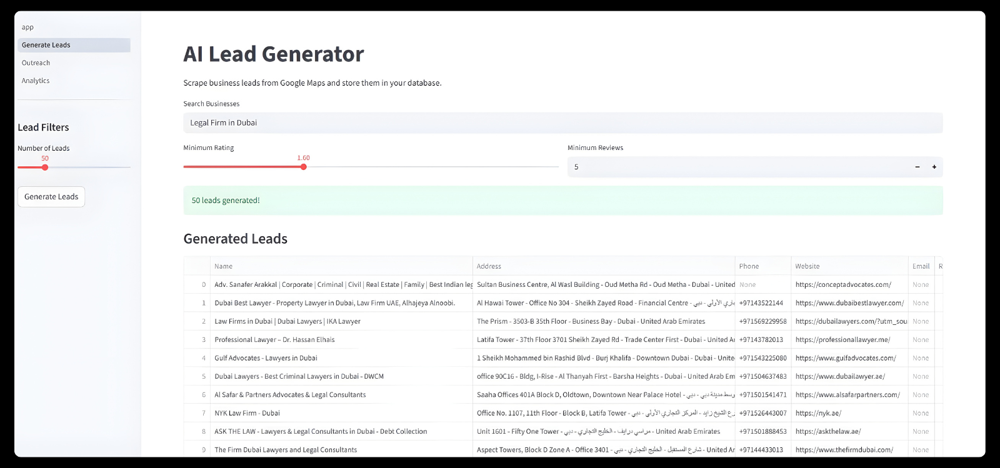

<p align="center">
  
</p>

# LeadFlow AI

AI-powered lead generation and outreach automation platform.

Generate business leads from Google Maps, enrich them with contact data, and run outreach campaigns from one dashboard.

## Features

- Google Maps Lead Discovery  
- Business Data Extraction  
- Email Enrichment  
- Bulk Outreach Campaigns  
- Campaign Analytics Dashboard  
- Email & WhatsApp Outreach Support

  ## Screenshots

### Lead Generation



## Tech Stack

- Python
- Streamlit
- Google Maps API
- Gemini AI
- SQLite
- Pandas

## Project Structure

leadflow/
├── app.py
├── scraper.py
├── database.py
├── requirements.txt
│
├── pages/
│   ├── 1_Generate_Leads.py
│   ├── 2_Outreach.py
│   ├── 3_Analytics.py
│
├── utils/
│   ├── email_extractor.py
│   ├── phone_utils.py
│   ├── geo_utils.py

## Installation

Clone the repo

```bash
git clone https://github.com/atifkhan78666/leadflow-ai.git
cd leadflow-ai

pip install -r requirements.txt
streamlit run app.py
---

# Environment Variables

```markdown
## Environment Variables

Create a `.env` file and add:

GOOGLE_MAPS_API_KEY=your_key_here  
GEMINI_API_KEY=your_key_here

## Roadmap

- LinkedIn lead discovery
- AI lead scoring
- Automated follow-ups
- CRM integrations
